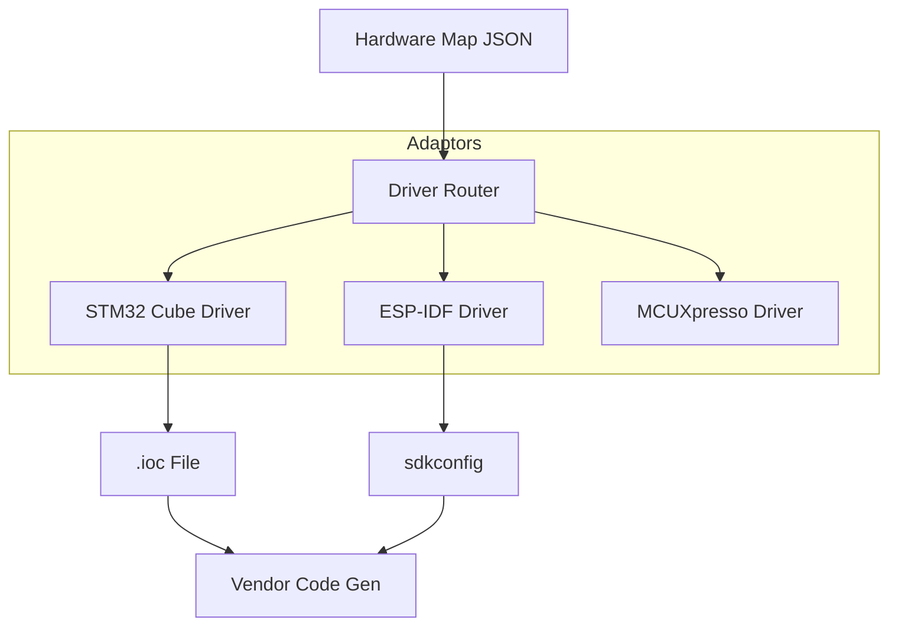

# Reify Driver

[](LICENSE)
[]()

> **The Universal Hardware Adaptor for ReifyFlow.**
> 
> **ReifyFlow 生态系统的通用硬件适配层。**

`reify-driver` 是连接抽象硬件定义 (`hardware_map.json`) 与具体厂商工具链（Vendor Toolchains）的桥梁。它通过统一的 CLI 接口，屏蔽了不同芯片厂商配置工具的差异。

## 🔌 Supported Drivers (支持的驱动)

| Driver ID | Target Vendor | Underlying Tool | Status |
| :--- | :--- | :--- | :--- |
| **`stm32_cube`** | STMicroelectronics | STM32CubeMX | ✅ Alpha |
| **`esp_idf`** | Espressif | ESP-IDF (Kconfig) | 📅 Planned |
| **`gd32_spl`** | GigaDevice | Standard Peripheral Lib | 📅 Planned |

## 🏗️ Architecture



## 🚀 Usage

### 通用 CLI 命令
无需关心底层是 CubeMX 还是 CMake，统一使用以下命令：

```bash
# 自动识别目标芯片并调用对应驱动
python -m reify_driver apply --config ./hardware_map.json --target stm32f103
```

## 🔧 Developer Guide (开发指南)

如果您想为新芯片添加支持，请继承 `core.base_driver.BaseDriver` 类并实现以下接口：
- `load_project()`
- `modify_pin_config()`
- `generate_code()`

---
*Part of the ReifyFlow Ecosystem.*
```
